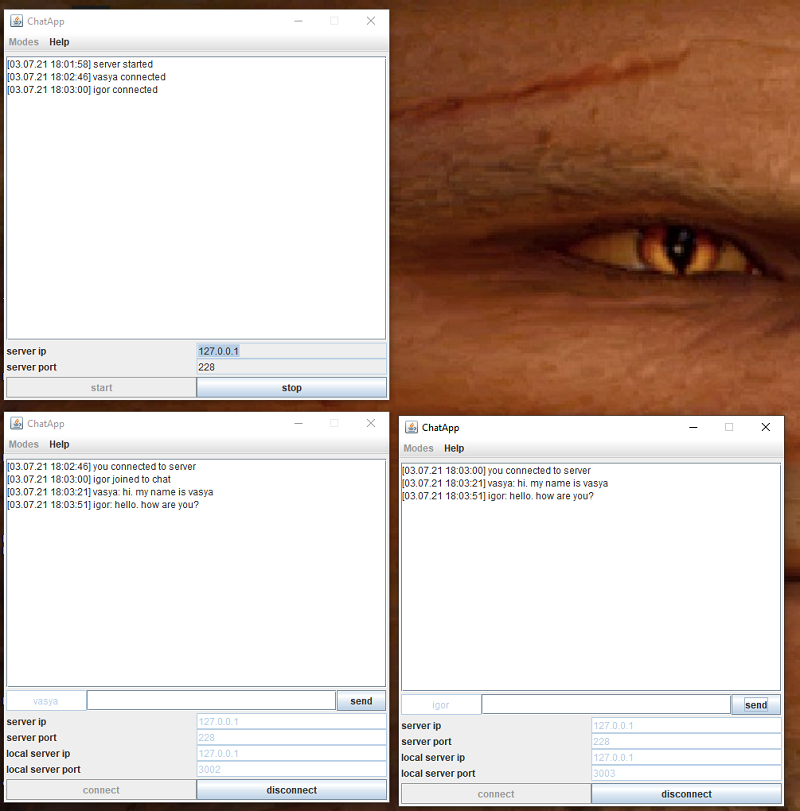

# Gui chat akka remote

## Info
This is gui client-server chat app powered by akka remote. Start one instance in server mode and start several instances in client mode.
Have fun.

#### Assembly and run
* sbt assembly
* java -jar chat-assembly-0.1.jar

#### Note
 * If you run several clients on single pc make sure each client has different port.

